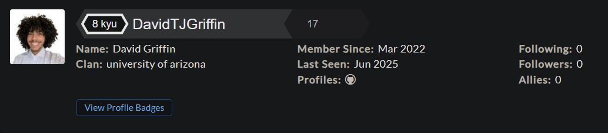

# CodeWars Challenges: <a target="_blank" href="https://www.codewars.com/users/DavidTJGriffin/stats">Visit Here</a>

A growing collection of Python kata I've completed on CodeWars. Just getting started, but each challenge helps sharpen my logic and fluency.

## How It's Made

**Tech Used:**  

All solutions are in Python, written with readability in mind.

## Optimizations

I revisit problems to simplify logic and explore cleaner solutions. Clarity over cleverness.

## Lessons Learned

There’s always more than one way to solve a problem. Even simple challenges teach me new ways to think.
